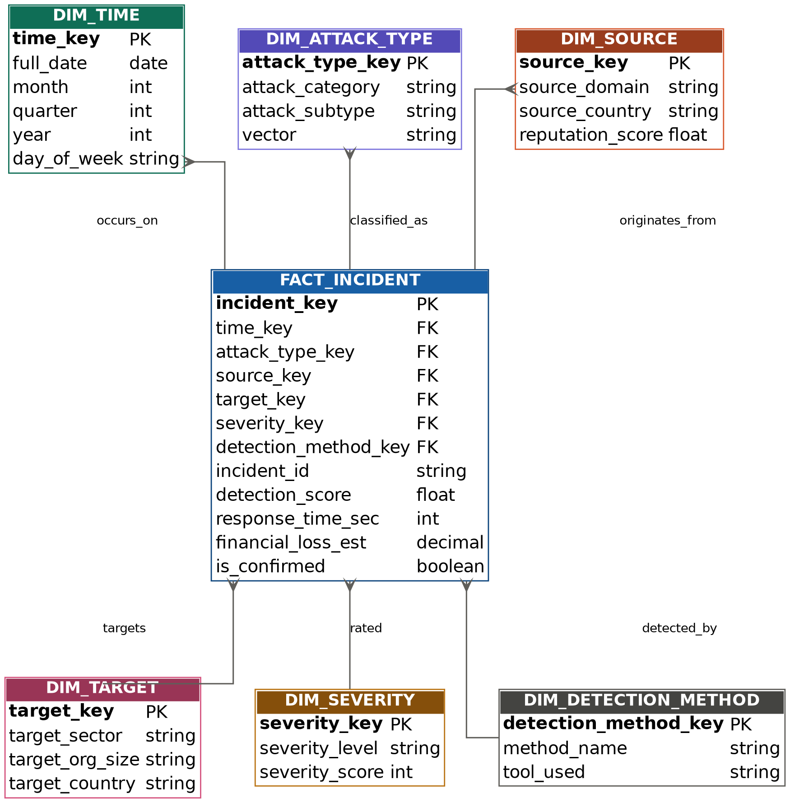

# Phishing & Social Engineering Cybersecurity Data Warehouse

A star schema-based data warehouse for knowledge discovery from phishing and
social engineering data, built with OLAP analysis and data mining
(clustering + classification).

## Overview

This project designs and implements a complete data warehouse pipeline for
cybersecurity threat intelligence:

1. **Dimensional modeling** — a star schema (1 fact table + 6 dimensions)
   designed around detected phishing/social-engineering incidents
2. **ETL pipeline** — Python/pandas + PostgreSQL, integrating three real
   data sources into a unified schema
3. **OLAP analysis** — roll-up, drill-down, slice, dice, and cube operations
   using native PostgreSQL `GROUPING SETS`/`ROLLUP`/`CUBE`
4. **Data mining** — K-Means clustering (pattern discovery) and SVM
   classification (phishing/benign prediction)
5. **Evaluation** — query performance benchmarking and comparison against
   published baselines

Full methodology and results are documented in [`docs/final_report_IEEE.pdf`](docs/final_report_IEEE.pdf),
building on the systematic literature review in [`docs/SLR.pdf`](docs/SLR.pdf).

## Architecture



**Fact table**: `FACT_INCIDENT` (grain: one row per detected incident)
**Dimensions**: Time, Attack Type, Source, Target, Severity, Detection Method

## Data Sources

| Source | Rows | Role |
|---|---|---|
| [phreshphish](https://huggingface.co/datasets/phreshphish/phreshphish) | 1,000 (sampled) | Primary phishing/benign dataset — real dates, target brands |
| [OpenPhish (Kaggle)](https://www.kaggle.com/datasets/shantanu199/openphish-malicious-urls) | 6,306 | Bulk phishing URL feed |
| UC Berkeley Phish Tank Archive | 13 | Hand-curated social engineering case studies (see [`data/berkeley_se_incidents.csv`](data/berkeley_se_incidents.csv)) |

Raw third-party datasets are not redistributed here due to licensing —
see [`data/README.md`](data/README.md) for links to obtain them directly.

## Key Results

- **OLAP**: sub-2ms query response on filtered analytical queries;
  ~11ms on full 4-way joins with grouping across 6,726 fact rows
- **Clustering**: K-Means (k=4) identified four distinct phishing-URL
  construction patterns — see [`results/clusters_pca.png`](results/clusters_pca.png)
- **Classification**: SVM with balanced class weighting achieved
  99.6% precision / 86.2% recall on phishing detection (see
  [`results/confusion_matrix.png`](results/confusion_matrix.png))

## Repository Structure

```
├── docs/       SLR, final report, ER diagram
├── sql/        Star schema DDL, scalability test
├── etl/        ETL pipeline (source → warehouse)
├── mining/     Clustering + classification scripts
├── results/    Output visualizations
└── data/       Hand-curated dataset + source links
```

## Tech Stack

PostgreSQL · Python (pandas, scikit-learn, psycopg2) · SQL (window functions, GROUPING SETS/ROLLUP/CUBE) · matplotlib

## Reproducing This Project

```bash
# 1. Create the database and schema
createdb phishing_dw
psql -d phishing_dw -f sql/schema.sql

# 2. Run the ETL (requires the source CSVs — see data/README.md for links)
python3 etl/etl.py

# 3. Run OLAP queries directly in psql, or via your own scripts

# 4. Run the mining pipeline
python3 mining/mining.py
python3 mining/cluster_final.py
python3 mining/classify.py
```

## Author

- **Maya KC** ([@MK-2025-cell](https://github.com/MK-2025-cell)) — Computer Science, Asian University for Women
- **Tamana Fazel** ([@fazeltamana](https://github.com/fazeltamana)) — Computer Science, Asian University for Women
- **Lipi Sarkar** ([@LipiSarkar-crd]https://github.com/LipiSarkar-crd) — Computer Science, Asian University for Women

